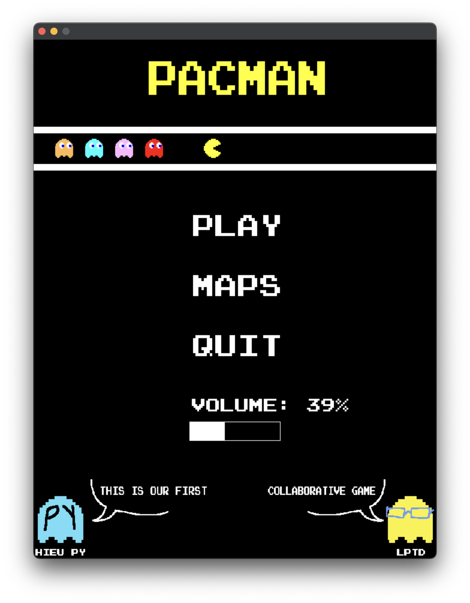
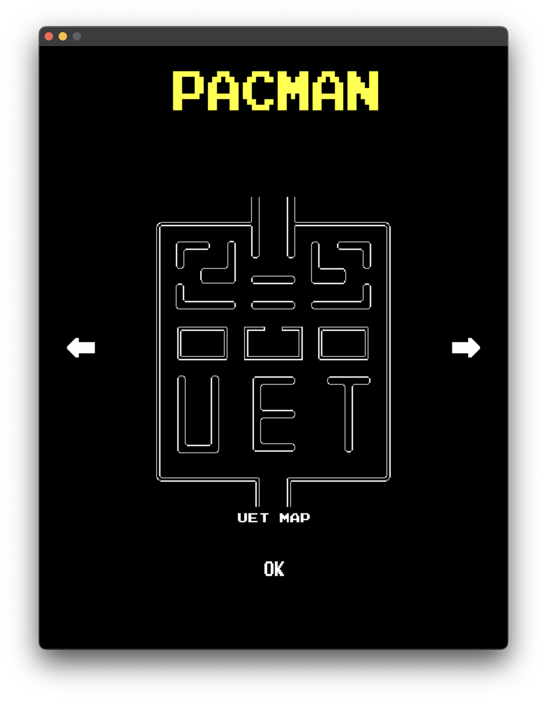
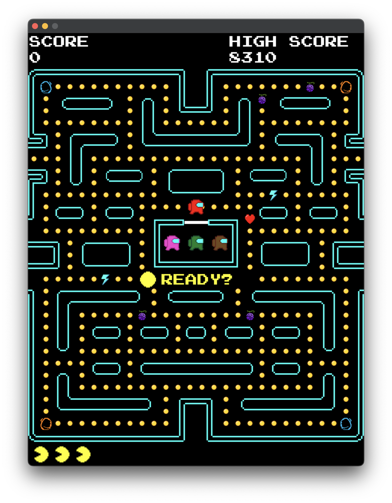
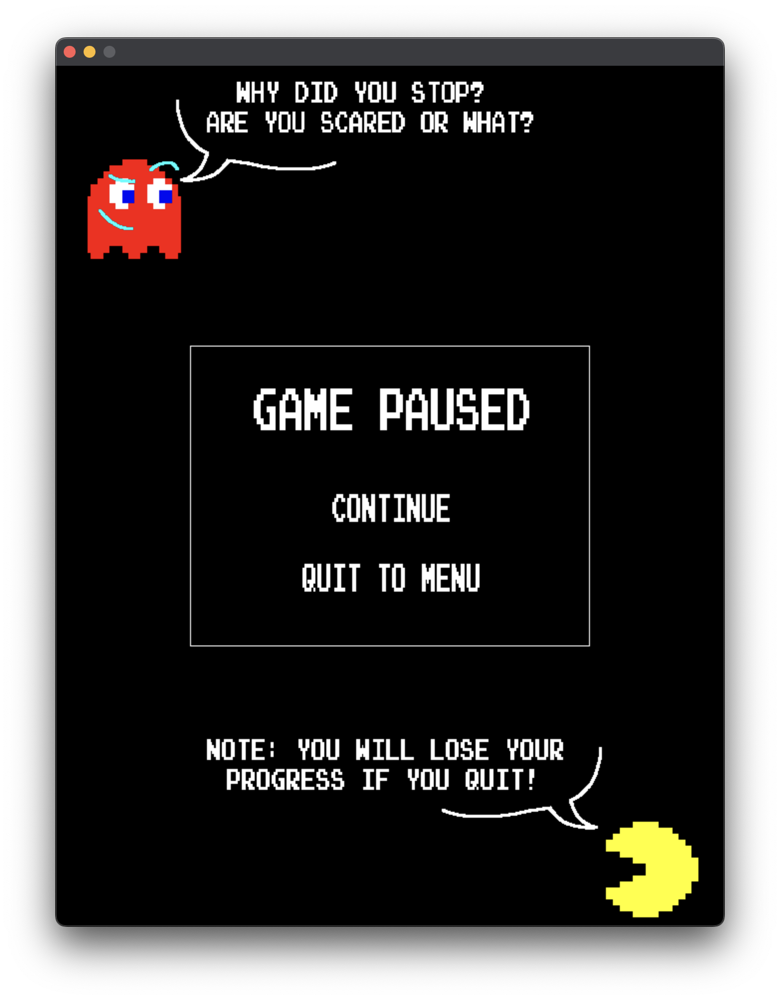
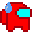

```
 _______  _______  _______  __   __  _______  __    _             _______  ______   ___      _______ 
|       ||   _   ||       ||  |_|  ||   _   ||  |  | |           |       ||      | |   |    |       |
|    _  ||  |_|  ||       ||       ||  |_|  ||   |_| |   ____    |  _____||  _    ||   |    |____   |
|   |_| ||       ||       ||       ||       ||       |  |____|   | |_____ | | |   ||   |     ____|  |
|    ___||       ||      _||       ||       ||  _    |           |_____  || |_|   ||   |___ | ______|
|   |    |   _   ||     |_ | ||_|| ||   _   || | |   |            _____| ||       ||       || |_____ 
|___|    |__| |__||_______||_|   |_||__| |__||_|  |__|           |_______||______| |_______||_______|
```
- [Giới thiệu game](#1-giới-thiệu-game)

- [Main menu](#2-main-menu)

- [Chơi game](#3-chơi-game)

- [Khác](#4-khác)

  * [Hoạt ảnh](#hoạt-ảnh)
  * [AImpostor](#aimpostor)
  * [Credits](#credits)

# 1. Giới thiệu Game
Vào một ngày đẹp trời, thị trấn mà Pacman sinh sống bị UFO xâm chiếm. Những người ngoài hành tinh trên chiếc UFO chiếm đoạt tiền xu của người dân thị trấn vốn đã nghèo khó, khốn khổ và bần hàn.  Sử dụng sức mạnh từ trái chuối vàng, anh dấn thân vào hành trình lấy lại những tài sản đã mất. Đột nhập vào phi thuyền của chúng là những mê cung, Pacman phải đối mặt với những cặm bẫy và thách thức từ những kẻ ngoại đạo tàn ác không có tay. Bằng sự can đảm và khéo léo tận dụng những vật phẩm rải rác trong mê cung, anh chinh phục mọi thử thách, vượt qua mọi rủi ro để đánh bại người ngoài hành tinh và lấy lại tiền xu mà chúng đã đánh cắp, tái lập hòa bình cho thị trấn. Cuối cùng, Pacman trở thành biểu tượng của sự hy vọng và chiến thắng. Game dựa trên một câu chuyện hoàn toàn (không) có thật.

# 2. Main menu 
- Ngay ở màn hình chờ, ta đã thấy được Impostor và Pacman rượt nhau xuyên màn hình.
- Ta có thể bẳt đầu game bằng cách nhấn nút PLAY.
- Điều chỉnh âm lượng bằng thanh âm lượng dưới chữ VOLUME.
- Bạn có thể thoát ra bằng nút QUIT.
- Ta có thể chiêm ngưỡng dung nhan của 2 tác giả ở 2 góc màn hình.

- Không chỉ thế, ta còn có thể nhấn MAPS để lựa chọn 1 trong 4 map khác nhau:
  - Map gốc
  - Map cải tiến
  - Map yêu trường
  - Map luyện tập

# 3. Chơi Game
- Sau khi chọn map và nhấn PLAY, bạn sẽ có thể bắt đầu tận hưởng tựa game này.
- Game sẽ cho bạn chuẩn bị trong vòng 3s.

- Để giành được chiến thắng trước những tên ngoài hành tinh gian ác và đầy màu sắc này, ta cần di chuyển khôn khéo để tránh những thế lực hắc ám và lấy được hết ***tất cả*** các đồng xu  trên màn hình.
- Như có thể thấy, chúng ta có những vật phẩm đồng hành trên con đường giành lại chính nghĩa. Tuy nhiên, sau mỗi trận rượt đuổi gay go, những vật phẩm sẽ được sinh ra *hoàn toàn ngẫu nhiên* theo một thuật toán phức tạp!
- Các vật phẩm:
  - <span style = "color : purple">Trái ác quỷ</span> (Gomu Gomu no Mi) ban tặng cho Pacman sức hủy diệt kinh hoàng trong một khoảng thời gian có hạn: 
  - <span style = "color : cyan">Tia sét</span> của thần Zeus đem lại cho Pacman tốc độ ánh sáng c = 299 792 458 m/s để anh bỏ xa các tên ngoài hành tinh háu ăn: 
  - <span style = "color : red">Trái tim</span> của Aphrodite ban cho Pacman thêm một cơ hội làm lại cuộc đời (nếu Pacman đã mất mạng): 
  - <span style = "color : orange">Cánh cửa</span> <span style = "color : blue">thần kì</span> (どこでもドア) của Doraemon giúp Nobi-pac được phen thoát chết khi bị dí ép góc:    (chắc chắn không phải từ game Portal)
- Nếu bạn muốn nhân vật Pacman của mình trụ thêm được ít lâu thì bạn có thể bấm SPACE để pause game, màn hình sẽ hiện ra một màn hình tạm dừng. Ở đó, bạn có thể thấy hình ảnh một tên ngoài hành tinh nham hiểm và một chú Pacman cute phomaique. Bạn có thể bấm quit to menu để tránh phải xem cảnh giết người kinh dị của những tên khát máu với chú Pacman yếu đuối hoặc có thể tiếp tục để chứng kiến cảnh Pacman bị dí đến chết.

- Nếu như may mắn giành được chiến thắng, bạn sẽ được nhận một phần thưởng bất ngờ 🎆 🎇.

# 4. Khác
## Hoạt ảnh
Hoạt ảnh của Impostor được tác giả tự sáng tác dưới 3 dạng khác nhau:

 *- Impostor trong chế độ săn lùng người chơi*

 *- Impostor cảm thấy không ổn lắm sau khi người chơi cắn trái ác quỷ *

 *- Impostor bị người chơi gặm mất nửa người và bỏ chạy về nhà mách mẹ*
## AImpostor
 *- Chiến thuật đơn giản và có vẻ hiệu quả: ***Nhắm thẳng*** tới bạn*

 *- Dự đoán trước hướng đi bạn sắp tới và ***đón đầu*** bạn*

 *- Thường xuyên ***phối hợp*** với <span style="color:red">Impostor đỏ</span> để chặn đầu bạn*

 *- Cơ chế vô cùng đặc biệt và ***khó đoán****

## Credits

- Dưới công sức của [mình](https://github.com/lephantriduc) và [bạn mình](https://github.com/hieupy2k5).
- [Trang web tham khảo hướng dẫn chi tiết làm game bằng SDL2 (chắc ai cũng biết)](https://lazyfoo.net)
- [Tác giả của một trong hai tựa game gốc chúng mình lấy ý tưởng](https://en.wikipedia.org/wiki/Toru_Iwatani).
- [Công ty của tựa game còn lại](https://www.innersloth.com).


```
. 　　　。　　　　•　 　ﾟ　　。 　　.

　　　.　　　 　　.　　　　　。　　 。　. 　

.　　 。　　　　　 ඞ 。 . 　　 • 　　　　•

　　ﾟ　　 SusRed was An Impostor.　 。　.

　　'　　　 3 Impostors remain 　 　　。

　　ﾟ　　　.　　　. ,　　　　.　 .
```
