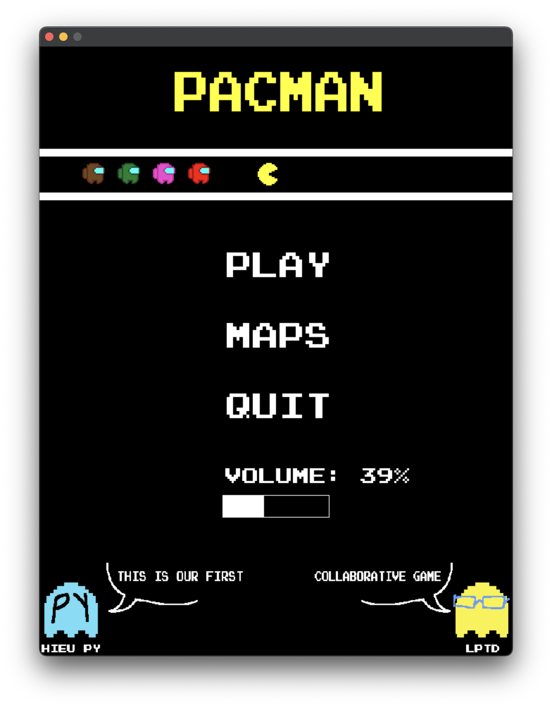
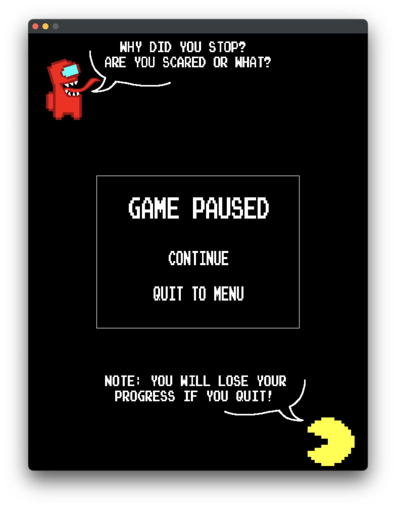

```
 _______  _______  _______  __   __  _______  __    _             _______  ______   ___      _______ 
|       ||   _   ||       ||  |_|  ||   _   ||  |  | |           |       ||      | |   |    |       |
|    _  ||  |_|  ||       ||       ||  |_|  ||   |_| |   ____    |  _____||  _    ||   |    |____   |
|   |_| ||       ||       ||       ||       ||       |  |____|   | |_____ | | |   ||   |     ____|  |
|    ___||       ||      _||       ||       ||  _    |           |_____  || |_|   ||   |___ | ______|
|   |    |   _   ||     |_ | ||_|| ||   _   || | |   |            _____| ||       ||       || |_____ 
|___|    |__| |__||_______||_|   |_||__| |__||_|  |__|           |_______||______| |_______||_______|
```
# 1. Giới thiệu Game
Trong một thế giới đầy mê cung và nguy hiểm, Pac-Man đối mặt với thị trấn bị ma quỷ xâm chiếm. Sử dụng sức mạnh từ trái chuối vàng, anh dấn thân vào cuộc hành trình khám phá và giải cứu. Trải qua mê cung, anh phải đối mặt với những bẫy và thách thức từ những con ma ác. Bằng sự can đảm và khéo léo, anh chinh phục mọi thử thách, vượt qua mọi rủi ro để đánh bại ma quỷ và tái lập hòa bình cho thị trấn. Cuối cùng, Pac-Man trở thành biểu tượng của sự hy vọng và chiến thắng.

# 2. Main menu
- Ngay ở màn hình chờ, ta đã được thấy một sự rượt đuổi gay cấn của những con ma.
- Ta có thể bẳt đầu game bằng cách nhấn nút PLAY.
- Điều chỉnh âm lượng bằng thanh âm lượng dưới chữ VOLUME.
- Bạn có thể thoát ra bằng nút QUIT.
- Ta có thể chiêm ngưỡng dung nhan của 2 tác giả ở 2 góc màn hình.

- Không chỉ thế, ta còn có thể nhấn MAPS để lựa chọn 1 trong 4 map khác nhau:
  - Map gốc
  - Map cải tiến
  - Map yêu trường
  - Map luyện tập

# 3. Chơi Game
- Sau khi chọn map và nhấn PLAY, bạn sẽ có thể bắt đầu tận hưởng tựa game này.
- Game sẽ cho bạn chuẩn bị trong vòng 3s.

- Để giành được chiến thắng trước những con ma gian ác và sặc sỡ này, ta cần di chuyển khôn khéo để tránh những thế lực hắc ám và ăn hết ***tất cả*** các đốm trắng trên màn hình.
- Như có thể thấy, chúng ta có những vật phẩm đồng hành trên con đường giành lại chính nghĩa. Tuy nhiên, sau mỗi trận rượt đuổi gay go, những vật phẩm sẽ được sinh ra *hoàn toàn ngẫu nhiên* theo một thuật toán phức tạp!
- Các vật phẩm:
  - Trái ác quỷ (Gomu Gomu no Mi) ban tặng cho Pacman sức hủy diệt kinh hoàng trong một khoảng thá»i gian có hạn: 
  - Tia sét của thần Zeus đem lại cho Pacman tốc độ của thần để anh bỠxa các con ma háu ăn: 
  - Trái tim của Aphrodite ban cho Pacman thêm một cơ hội làm lại cuộc đời (nếu Pacman đã mất mạng): 
  - Cánh cửa thần kì (どこでもドア) của Doraemon giúp Nobi-pacman được phen thoát chết khi bị ép góc:    (chắc chắn không phải từ game Portal)
- Nếu bạn muốn nhân vật Pacman của mình trụ thêm được ít lâu thì bạn có thể bấm SPACE để pause game, màn hình sẽ hiện ra một màn hình tạm dừng. Ở đó, bạn có thể thấy hình ảnh một con ma lấc cấc và một chú Pacman cute phomaique. Bạn có thể bấm quit to menu để tránh phải xem cảnh giết người kinh dị của những con ma khát máu với chú Pacman yếu đuối hoặc có thể tiếp tục để chứng kiến cảnh Pacman bị dí đến chết.

- Nếu như may mắn giành được chiến thắng, bạn sẽ được nhận một phần thưởng bất ngờ 🎆 🎇.
